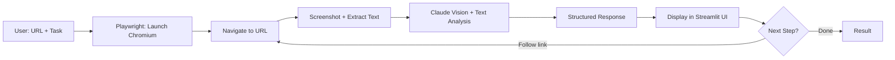

# Browser Automation Agent — Workflow Architecture

## Agent Flow

## 5-Layer Architecture

| Layer | Detail |
|-------|--------|
| **Trigger** | User submits URL + task in Streamlit UI (or API call / scheduled cron) |
| **Input** | Target URL + natural language task description |
| **Processing** | Playwright navigates + captures; Claude vision analyzes screenshot + page text |
| **Output** | Claude's structured analysis (text, lists, extracted data) returned to UI |
| **Verification** | Screenshot shown alongside analysis — human can verify accuracy |

## Production Extensions

- **Auth flows:** Pass session cookies or run Playwright with stored browser state
- **Multi-step:** Chain multiple page navigations with Claude deciding next URL/click
- **Scheduled runs:** n8n cron → API call → results pushed to Notion/Airtable/Slack
- **Data extraction:** Claude returns structured JSON instead of text for downstream processing
- **Error handling:** Retry on timeout, fallback to text-only if screenshot fails
